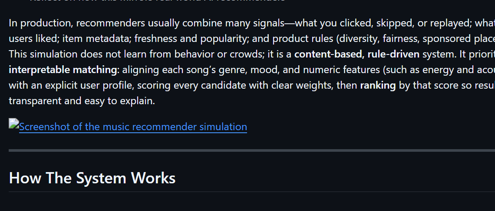

# 🎵 Music Recommender Simulation

## Project Summary

In this project you will build and explain a small music recommender system.

Your goal is to:

- Represent songs and a user "taste profile" as data
- Design a scoring rule that turns that data into recommendations
- Evaluate what your system gets right and wrong
- Reflect on how this mirrors real world AI recommenders

In production, recommenders usually combine many signals—what you clicked, skipped, or replayed; what similar users liked; item metadata; freshness and popularity; and product rules (diversity, fairness, sponsored placement). This simulation does not learn from behavior or crowds; it is a **content-based, rule-driven** system. It prioritizes **interpretable matching**: aligning each song’s genre, mood, and numeric features (such as energy and acousticness) with an explicit user profile, scoring every candidate with clear weights, then **ranking** by that score so results are transparent and easy to explain.



---

## How The System Works

### Song Features

Each song in `data/songs.csv` carries 10 features used for scoring:

| Feature | Type | Description |
|---|---|---|
| `genre` | categorical | Musical category (pop, rock, lofi, jazz, etc.) |
| `mood` | categorical | Emotional feel (happy, chill, intense, energetic, etc.) |
| `energy` | 0–1 float | Perceived intensity and activity level |
| `acousticness` | 0–1 float | Likelihood the track is acoustic vs. produced |
| `valence` | 0–1 float | Musical positiveness (high = upbeat, low = dark) |
| `danceability` | 0–1 float | How suitable the track is for dancing |
| `instrumentalness` | 0–1 float | Predicts absence of vocals (high = instrumental) |
| `speechiness` | 0–1 float | Presence of spoken word or rap |
| `liveness` | 0–1 float | Presence of a live audience or live recording feel |
| `tempo_bpm` | float | Beats per minute (loaded but not used in scoring — largely redundant with energy) |

### User Profile

The user profile is a dictionary of target values that describes a listener's taste:

```python
user_prefs = {
    "genre": "pop",               # preferred genre (categorical)
    "mood": "energetic",          # preferred mood (categorical)
    "target_energy": 0.85,        # wants high-energy tracks
    "target_acousticness": 0.10,  # prefers produced/electronic sound
    "target_valence": 0.80,       # upbeat, positive-sounding tracks
    "target_danceability": 0.85,  # highly danceable
    "target_speechiness": 0.08,   # minimal spoken word
    "target_instrumentalness": 0.05, # vocal-forward songs preferred
    "target_liveness": 0.12,      # studio recordings over live feel
}
```

### Algorithm Recipe

Every song in the catalog is scored against the user profile. The score has two parts: categorical bonuses and numeric similarity.

**Categorical bonuses (binary match):**

| Match | Points |
|---|---|
| Genre matches user's preferred genre | +2.0 |
| Mood matches user's preferred mood | +1.5 |

**Numeric similarity (per feature):**

Each numeric feature contributes `weight × (1 − |target − actual|)`, where a perfect match yields the full weight and a maximum mismatch yields 0.

| Feature | Weight | Tier |
|---|---|---|
| `energy` | ×1.2 | 1 — widest range, strongest separator |
| `acousticness` | ×1.0 | 1 — cleanly separates electronic vs. organic |
| `valence` | ×0.6 | 2 — compressed range, lower impact |
| `danceability` | ×0.6 | 2 — correlates with energy, lower independent weight |
| `instrumentalness` | ×0.5 | 2 — vocal preference signal |
| `speechiness` | ×0.4 | 2 — low catalog variance |
| `liveness` | ×0.3 | 2 — least user-facing preference |

**Maximum possible score: 8.1** (2.0 + 1.5 + 1.2 + 1.0 + 0.6 + 0.6 + 0.5 + 0.4 + 0.3)

All 18 songs are scored, sorted highest to lowest, and the top K are returned with their score and a plain-language explanation.

### Potential Biases

- **Genre over-prioritization.** The +2.0 genre bonus is large enough that a mediocre pop song can outrank an excellent rock or hip-hop song that matches nearly every numeric target. A great mood-and-energy match in the wrong genre may never surface.
- **Mood label coarseness.** Moods like `intense` and `energetic` feel nearly identical to a listener, but the system treats them as completely different and awards zero overlap credit. A rock song tagged `intense` scores no mood bonus for a user who wants `energetic`.
- **Profile is a single fixed point.** The user profile is one static dict. Real listeners have range — someone who usually wants chill lofi might want high-energy pop on a Friday. The system has no way to represent that.
- **Catalog skew.** The 18-song catalog is not representative. Genres like classical, metal, and blues each have one song, so users whose taste aligns with those genres will always get a thin top-K regardless of score quality.
- **Numeric features are synthetic.** The feature values were generated, not measured from audio. Scores reflect how internally consistent the data is, not how the songs actually sound.

---

## Getting Started

### Setup

1. Create a virtual environment (optional but recommended):

   ```bash
   python -m venv .venv
   source .venv/bin/activate      # Mac or Linux
   .venv\Scripts\activate         # Windows

2. Install dependencies

```bash
pip install -r requirements.txt
```

3. Run the app:

```bash
python -m src.main
```

### Running Tests

Run the starter tests with:

```bash
pytest
```

You can add more tests in `tests/test_recommender.py`.

---

## Experiments You Tried

Use this section to document the experiments you ran. For example:

- What happened when you changed the weight on genre from 2.0 to 0.5
- What happened when you added tempo or valence to the score
- How did your system behave for different types of users

---

## Limitations and Risks

Summarize some limitations of your recommender.

Examples:

- It only works on a tiny catalog
- It does not understand lyrics or language
- It might over favor one genre or mood

You will go deeper on this in your model card.

---

## Reflection

Read and complete `model_card.md`:

[**Model Card**](model_card.md)

Write 1 to 2 paragraphs here about what you learned:

- about how recommenders turn data into predictions
- about where bias or unfairness could show up in systems like this


---

## 7. `model_card_template.md`

Combines reflection and model card framing from the Module 3 guidance. :contentReference[oaicite:2]{index=2}  

```markdown
# 🎧 Model Card - Music Recommender Simulation

## 1. Model Name

Give your recommender a name, for example:

> VibeFinder 1.0

---

## 2. Intended Use

- What is this system trying to do
- Who is it for

Example:

> This model suggests 3 to 5 songs from a small catalog based on a user's preferred genre, mood, and energy level. It is for classroom exploration only, not for real users.

---

## 3. How It Works (Short Explanation)

Describe your scoring logic in plain language.

- What features of each song does it consider
- What information about the user does it use
- How does it turn those into a number

Try to avoid code in this section, treat it like an explanation to a non programmer.

---

## 4. Data

Describe your dataset.

- How many songs are in `data/songs.csv`
- Did you add or remove any songs
- What kinds of genres or moods are represented
- Whose taste does this data mostly reflect

---

## 5. Strengths

Where does your recommender work well

You can think about:
- Situations where the top results "felt right"
- Particular user profiles it served well
- Simplicity or transparency benefits

---

## 6. Limitations and Bias

Where does your recommender struggle

Some prompts:
- Does it ignore some genres or moods
- Does it treat all users as if they have the same taste shape
- Is it biased toward high energy or one genre by default
- How could this be unfair if used in a real product

---

## 7. Evaluation

How did you check your system

Examples:
- You tried multiple user profiles and wrote down whether the results matched your expectations
- You compared your simulation to what a real app like Spotify or YouTube tends to recommend
- You wrote tests for your scoring logic

You do not need a numeric metric, but if you used one, explain what it measures.

---

## 8. Future Work

If you had more time, how would you improve this recommender

Examples:

- Add support for multiple users and "group vibe" recommendations
- Balance diversity of songs instead of always picking the closest match
- Use more features, like tempo ranges or lyric themes

---

## 9. Personal Reflection

A few sentences about what you learned:

- What surprised you about how your system behaved
- How did building this change how you think about real music recommenders
- Where do you think human judgment still matters, even if the model seems "smart"

