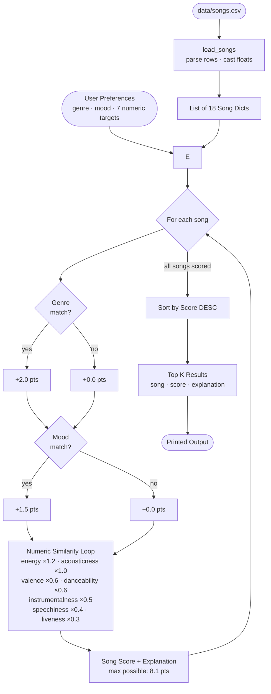

# Music Recommender — Data Flow

```mermaid
flowchart TD
    A([User Preferences\ngenre · mood · 7 numeric targets]) --> E
    B([data/songs.csv]) --> C[load_songs\nparse rows · cast floats]
    C --> D[List of 18 Song Dicts]
    D --> E

    E --> F{For each song}

    F --> G{Genre\nmatch?}
    G -- yes --> G1[+2.0 pts]
    G -- no  --> G2[+0.0 pts]
    G1 & G2 --> H

    H{Mood\nmatch?}
    H -- yes --> H1[+1.5 pts]
    H -- no  --> H2[+0.0 pts]
    H1 & H2 --> I

    I[Numeric Similarity Loop\nenergy ×1.2 · acousticness ×1.0\nvalence ×0.6 · danceability ×0.6\ninstrumentalness ×0.5\nspeechiness ×0.4 · liveness ×0.3]

    I --> J[Song Score + Explanation\nmax possible: 8.1 pts]
    J --> F

    F -- all songs scored --> K[Sort by Score DESC]
    K --> L[Top K Results\nsong · score · explanation]
    L --> M([Printed Output])
```
